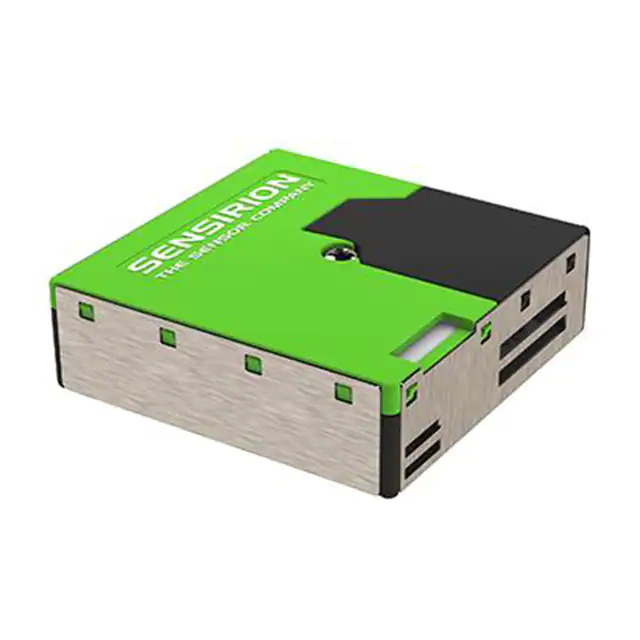

# Air Quality Sensor 🌱 

 Welcome to our ASRC Citizen Sensors Community! We're still building this space but feel free to use the materials available. Contact [kkrueger@gc.cuny.edu](mailto:kkrueger@gc.cuny.edu) if you have any questions. We'll try to answer as soon as possible!
 
 The Air Quaity Sensor (AQS) is a low-cost, low-power DIY device with sensors for CO2, temp-pressure-relativehumidity, and PM2.5 (dust or smoke). It has an on-board logger and WiFi connectivity to Google Sheets for (almost) real time data reporting. 

  

**Table of Contents:**

   * [Community Sensor Lab - Air Quality Sensor]
      * [Technologies](#technologies)
         * [Microcontroller boards](#featherM0-Microcontroller-Boards)
         * [Sensors](#sensors)
         * [Additional Necessary Technologies](#additional-Necessary-Technologies)
      * [Data Collection via HTTP](#experiment-reports)
      * [Versions ](#versions-)
        * [AQS - v2](#air-quality-sensor-v2)
        * [AQS - v1](#air-quality-sensor-v1)

## Technologies💡
### FeatherM0-Microcontroller-Boards

| Board | Board Image | Use | Link |
|----------------|-------------------------------|----------|:--------------------------:|
|Feather M0 WiFi (WINC1500))|   |Connects to WiFi network. Brain of the system|[Adafruit](https://www.adafruit.com/product/3010)
|Featherwing Logger (RTC microSD)|  |Slot for microSD. Has a real time clock|[Adafruit](https://www.adafruit.com/product/2922)
|Featherwing OLED  | |Displays data values and can graph functions|[Adafruit](https://www.adafruit.com/product/2900)
|Feather Terminal Block | |Holds all the components together|[Adafruit](https://www.adafruit.com/product/2926)

### Sensors
| Sensor | Sensor Image | Use | Purchase Link |
|----------------|-------------------------------|----------|:--------------------------:|
|Sensirion SD30 CO2 NDIR| |Collects data on CO2 PPM|[Digi-Key](https://www.digikey.com/en/products/detail/sensirion-ag/SCD30/8445334?s=N4IgTCBcDaIMIHkwAIDKBRAcqhAlZAkmHMgLIIAiAQgKqrIAKA6qSALoC%2bQA)
|BME280 Temp. Press. Rel Humidity|  | Collects data of temperature, pressure and relative humidity|[Digi-Key](https://www.digikey.com/en/products/detail/adafruit-industries-llc/2922/5885911?s=N4IgTCBcDaIIIBE4BkDyBxdBRASgAgDEs4AVACVwHUBJAOXTwFo8cSBhPAajwGUEQAugF8gA)
|Sensirion SPS380 PM2.5| |Collects data on particulate matter|[Digi-Key](https://www.digikey.com/en/products/detail/sensirion-ag/SPS30/9598990)

### Additional-Necessary-Technologies
| Part | Part Image | Use | Purchase Link |
|----------------|-------------------------------|----------|:--------------------------:|
|Battery Lithium Polymer LiPo 3.7V|  |Device's battery|[Digi-Key](https://www.digikey.com/en/products/detail/adafruit-industries-llc/354/5054541)
|Battery Coin cr1220|  |Clock Battery|[Digi_Key](https://www.digikey.com/en/products/detail/renata-batteries/RENATA-CR1220-TS-1/13283109)
|Micro SD| |memory|[Digi-Key](https://www.digikey.com/en/products/detail/sensirion-ag/SPS30/9598990)

## Post🌐          
 

## Versions 🛠
### Air-Quality-Sensor-v2
This is our latest version of our Air Quality Sensor. The code on this page is the latest code.
### Air-Quality-Sensor-v1
Code from the first version of the Air Quality Sensor can be seen on the branch [Version-1](https://github.com/Community-Sensor-Lab/Air-Quality-Sensor/tree/Version-1)
