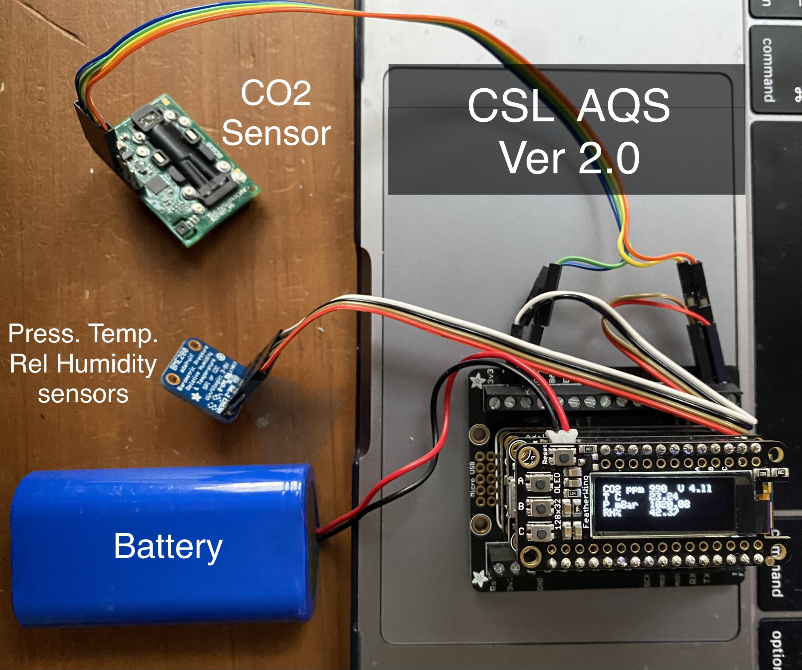

# Air Quality Sensor 🌱 

 Welcome to our ASRC Citizen Sensors Community! We're still building this space but feel free to use the materials available. Contact [kkrueger@gc.cuny.edu](mailto:kkrueger@gc.cuny.edu) if you have any questions. We'll try to answer!
 
 The Air Quaity Sensor (AQS) is a low-cost, low-power DIY device with sensors for CO2, temp-pressure-relativehumidity, and PM2.5 (dust or smoke). It has an on-board logger and WiFi connectivity to Google Sheets for (almost) real time data reporting. 

      

**Table of Contents:**

   * [Community Sensor Lab - Air Quality Sensor](#floodsense-project-sensor-experiments)
      * [Technologies](#featherM0_Microcontroller_Boards)
         * [Microcontroller boards](#featherM0_Microcontroller_Boards)
         * [Sensors](#sensors)
      * [Data Collection via HTTP](#experiment-reports)
      * [Versions ](#versions-)
        * [AQS - v2](#air-quality-sensor-v2)
        * [AQS - v1](#air-quality-sensor-v1)

## Technologies💡
### FeatherM0_Microcontroller_Boards

|    Boards, Batteries, and Headers  |Image|       Purpose           | Link |
|------------------------|---------------------|-----------------------------|----------------------------|
|Terminal Block (Base)|   |Used to keep everything together. Sensors are connected here      |[Adafruit](https://www.adafruit.com/product/2926)
|Display Board (OLED)|     |Displays values for gases or particles and can graph functions|[Adafruit](https://www.adafruit.com/product/2900)
|Battery | |-- is en-dash, --- is em-dash|
|Battery | |-- is en-dash, --- is em-dash|
|Dashes          |`-- is en-dash, --- is em-dash`|-- is en-dash, --- is em-dash|
| --- |---| ---|
| ffsddsf | ffsfsdf |
| ffsddsf | ffsfsdf |
## WiFi🌐          
 
## Versions 🛠
### Air-Quality-Sensor-v1
Code from the first version of the Air Quality Sensor can be seen on the branch [Version-1](https://github.com/Community-Sensor-Lab/Air-Quality-Sensor/tree/Version-1)
### AQS - v2
This is the repository with the latest code

Feather M0 Microcontroller boards

Feather M0 WiFi (WINC1500)
Featherwing Logger (RTC microSD)
Featherwing OLED 
Feather terminal block

Sensors

Sensirion SD30 CO2 NDIR
BME280 Temp. Press. Rel Humidity 
Sensirion SPS30 PM2.5

Other necessary stuff

Battery Lithium Polymer LiPo 3.7V
Battery coin cr1220
Memory microSD (>8GB)

