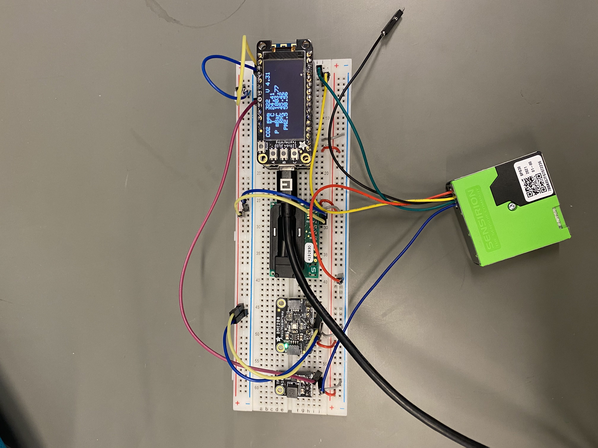

# Air Quality Sensor V3 using WiFi to Google Sheets 🌱 

 Welcome to our ASRC Community Sensor Lab! We're still building this space but feel free to use the materials available. Contact [kkrueger@gc.cuny.edu](mailto:kkrueger@gc.cuny.edu) if you have any questions. We'll try to answer as soon as possible!
 
 The Air Quaity Sensor (AQS) is a **low-cost**, **low-power** DIY device with sensors for **CO2**, **temp-pressure-relativehumidity**, and **PM2.5** (dust or smoke). It has an on-board logger and WiFi connectivity to Google Sheets for (almost) real time data reporting. 
 

V3 has code for the SPS30 PM2.5 and HSC differential pressure (Met Museum) sensors. If these are not pesent the code keeps going and reports 'no sensor' to SD log and google sheet. Additionally, keeps the start-stop for Wifi and sleeps all for ~25mA operation. Version 4 coming soon.

  
 
                  

 

## Contents:

   * Community Sensor Lab 🌱 - Air Quality Sensor
      * [Starting From Scratch](#Starting-From-Scratch)
      * [Assembly](#Assembly)
      * [Arduino IDE](#Arduino-IDE)
      * [Setting Up Google Spreadsheet](#Setting-Up-Google-Spreadsheet)

## Starting-From-Scratch💡 
  #### [List of Parts](#Parts-List-)

### Soldering
[Guide On How To Solder Air Quality Sensor](https://docs.google.com/document/d/1l6jeO-1NOw7vDZXchC9iGBB8vkmnokzwbz_wixmtFyU/edit?usp=sharing)

## Assembly 
* [Air Quality Sensor Boards Assembly](https://docs.google.com/document/d/1AezJ0XiPEsc3vEHGtJqxCqGEe5GDv0d0T-DoVZDCgCY/edit?usp=sharing)

* [How to Connect Sensors to Boards](https://docs.google.com/document/d/1BrGlBl2Zau5XgyUAorEzxkr_Fa7h0j_XQgn0lQ-tBvw/edit?usp=sharing)

## Arduino-IDE
* [Installing Arduino and Getting Started](https://docs.google.com/document/d/16o8Np3GaZfSjQlxNWIgi12ycb2CosCJ2blwEGiTplbA/edit?usp=sharing)
### Downloading Code From Github 🐈‍⬛  
If you are new to Github, **Welcome!** 
Check out our guide:
[Downloading CSL AQS Code from Github](https://docs.google.com/document/d/1Vb9AufqkUwsVKtdozXMc4aboDjLqBNuyTXmZpECdKx0/edit?usp=sharing)

## Setting-Up-Google-Spreadsheet
### HTTP-Request-to-Google-Spreadsheet 🌐
The Air Quality Sensor can post data in (almost) real-time to a spreadsheet online through HTTP methods!
For instructions on getting the AQS connected with a Google Spreadsheet, take a look at our guide: [HTTP Posting to Google Spreadsheet](https://docs.google.com/document/d/1yNolfJr7s9rs_ewV7vN-bUsllEiPPxo2xeQbsmszQKE/edit?usp=sharing).
 In our guide we provide:
* A template specifically for the Air Quality Sensor 
* Step-by-step instructions to using the Google Script Editor for the AQS and deploying your app script
* Managing troubleshooting issues
* Step-by-step instructions to then connecting your App Script to the AQS through the Arduino IDE

## Parts-List 🖥 
Here are the materials you will need with links of where to find them. 

### FeatherM0-Microcontroller-Boards

| Board | Board Image | Use | Link |
|----------------|-------------------------------|----------|:--------------------------:|
|Feather M0 WiFi (WINC1500))|   |Connects to WiFi network. Brain of the system|[Adafruit](https://www.adafruit.com/product/3010)
|Featherwing Logger (RTC microSD)|  |Slot for microSD. Has a real time clock|[Adafruit](https://www.adafruit.com/product/2922)
|Featherwing OLED  | |Displays data values and can graph functions|[Adafruit](https://www.adafruit.com/product/2900)
|Feather Terminal Block | |Holds all the components together|[Adafruit](https://www.adafruit.com/product/2926)

### Sensors
| Sensor | Sensor Image | Use | Purchase Link |
|----------------|-------------------------------|----------|:--------------------------:|
|Sensirion SD30 CO2 NDIR| |Measures CO2 in PPM|[Digi-Key](https://www.digikey.com/en/products/detail/sensirion-ag/SCD30/8445334?s=N4IgTCBcDaIMIHkwAIDKBRAcqhAlZAkmHMgLIIAiAQgKqrIAKA6qSALoC%2bQA)
|BME280 Temp. Press. Rel Humidity|  | Measures temperature C, pressure hPa and relative humidity %|[Digi-Key](https://www.digikey.com/en/products/detail/adafruit-industries-llc/2652/5604372)
|Sensirion SPS380 PM2.5| |Measures particulate matter PM2.5+|[Digi-Key](https://www.digikey.com/en/products/detail/sensirion-ag/SPS30/9598990)
|Differential Pressure| |Measures particulate matter PM2.5+|[No Link Available at this time](https://www.digikey.com/en/products/detail/sensirion-ag/SPS30/9598990)

### Additional-Parts
| Part | Part Image | Use | Purchase Link |
|----------------|-------------------------------|----------|:--------------------------:|
|MiniBoost 5V|  |Boosts battery pawer to 5V|[Digi-Key](https://www.adafruit.com/product/4654)
|Battery Lithium Polymer LiPo 3.7V|  |Device's battery|[Digi-Key](https://www.digikey.com/en/products/detail/adafruit-industries-llc/354/5054541)
|Battery Coin cr1220|  |Clock Battery|[Digi_Key](https://www.digikey.com/en/products/detail/renata-batteries/RENATA-CR1220-TS-1/13283109)
|Micro SD| |non volatile memory|[Digi-Key](https://www.digikey.com/en/products/detail/delkin-devices-inc/USDCOEM-16GB/13882332)
|Jumper Wires| |connecting|[Adafruit](https://www.adafruit.com/product/1954)

### Diagram 🔦          

### Solar Integration ☀️ 
The Air Quality Sensor can be powered by the sun!
For instructions on getting the AQS connected to a solar panel visit our document guide: [Solar Integration for the AQS](https://docs.google.com/document/d/1Q-aV4gpCV_NFu_VYhCmv1KPlE8r25asAGBMgROmjtNk/edit?usp=sharing).

## Versions 🛠
### Air-Quality-Sensor-V4
This is currently still being worked upon. The code has been updated to allow communication from the google sheet to the sensor and allow provisioning so that the Wifi information does not need to be inputted into the code beforehand allowing it to be more versatile.[Upcoming-Version-4.0](https://github.com/Community-Sensor-Lab/Air-Quality-Sensor/tree/CSL-AQS-V4.0)
### Air-Quality-Sensor-V3
This is our current utilized version of code for our Air Quality Sensor. The code on this page is the latest code that is stable for usage. Bigger display screen, power booster, PM 2.5 and differential pressure sensors are included in this version [Version-3.0](https://github.com/Community-Sensor-Lab/Air-Quality-Sensor/tree/CSL-AQS-V3.0)
### Air-Quality-Sensor-V2.1
Code from version 2.1 of the Air Quality Sensor can be seen on the branch [Version-2.1](https://github.com/Community-Sensor-Lab/Air-Quality-Sensor/tree/CSL-AQS-V2.1)
### Air-Quality-Sensor-v1
Code from the first version of the Air Quality Sensor can be seen on the branch [Version-1](https://github.com/Community-Sensor-Lab/Air-Quality-Sensor/tree/Version-1)

